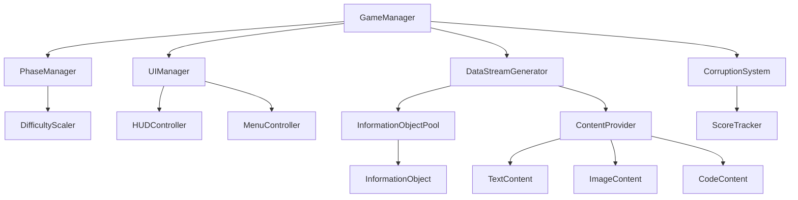

# Design Document

## Overview

The Human Firewall is an HTML5 web game with a focus on UI-driven gameplay. The game implements a real-time content classification system where players interact with flowing information objects through mouse clicks. The architecture follows modern web development patterns with clear separation between game logic, UI management, and content generation systems using HTML5 Canvas, CSS3, and vanilla JavaScript.

## Architecture

### Core Systems Architecture



### Page Structure

- **index.html**: Single page application with game canvas and UI overlays
- **Game States**: Menu state, gameplay state, and game over state managed through CSS classes and JavaScript
- **Canvas Layers**: Background canvas for game objects, UI overlay for HUD elements

## Components and Interfaces

### 1. Core Game Management

#### GameManager
- **Purpose**: Central coordinator for all game systems
- **Responsibilities**: 
  - Initialize and coordinate all subsystems
  - Handle game state transitions (Menu → Playing → GameOver)
  - Manage game timing and overall flow
- **Key Methods**:
  - `StartGame()`: Initialize gameplay systems
  - `EndGame(GameEndType endType)`: Handle game completion
  - `PauseGame()` / `ResumeGame()`: Game state control

#### PhaseManager
- **Purpose**: Control game progression and difficulty scaling
- **Responsibilities**:
  - Track current phase (Code → Art → Text cycle)
  - Increase difficulty every configurable interval (default 15 seconds)
  - Manage phase-specific content themes
- **Key Properties**:
  - `CurrentPhase`: Enum (Code, Art, Text)
  - `PhaseTimer`: Time remaining in current phase
  - `DifficultyMultiplier`: Current speed/spawn rate modifier
  - `PhaseDuration`: Configurable phase duration (exposed in Unity Inspector)

### 2. Information Stream System

#### DataStreamGenerator
- **Purpose**: Create and manage flowing information objects
- **Responsibilities**:
  - Spawn Information_Objects at controlled intervals
  - Manage object pooling for performance
  - Control spawn positions and movement patterns
- **Configuration**:
  - Base spawn interval: Configurable in Unity Inspector (default 0.5-1.0 seconds)
  - Spawn positions: Screen edges (top, left, right)
  - Movement speed: Configurable with difficulty scaling

#### InformationObject (JavaScript Class)
- **Purpose**: Individual data packets that flow across screen
- **Properties**:
  - `x, y`: Position coordinates
  - `width, height`: Dimensions for collision detection
  - `contentType`: String (text, image, code)
  - `isCorrupted`: Boolean indicating if content should be blocked
  - `movementSpeed`: Current movement velocity
  - `content`: The actual content to display
- **Methods**:
  - `update()`: Move toward bottom of screen
  - `render(ctx)`: Draw on canvas context
  - `isClicked(mouseX, mouseY)`: Check if mouse click hits this object
  - `destroy()`: Remove from game when reaching screen bottom

### 3. Content Classification System

#### ContentProvider
- **Purpose**: Load and manage content from configuration files for information objects
- **Responsibilities**:
  - Load content from separate configuration files for each content type
  - Provide content based on current phase theme
  - Manage content pools loaded from configuration
- **Content Configuration Files**:
  - **Text Content Config**: ScriptableObject containing legitimate and corrupted text examples
  - **Image Content Config**: ScriptableObject containing normal and corrupted image assets
  - **Code Content Config**: ScriptableObject containing correct and incorrect code snippets

#### CorruptionSystem
- **Purpose**: Track player performance and system integrity
- **Responsibilities**:
  - Monitor correct/incorrect classifications
  - Update corruption meter based on mistakes
  - Trigger game over when threshold reached
- **Metrics**:
  - Corruption level (0-100%)
  - Correct classifications count
  - Missed corrupted content count
  - False positive count

### 4. User Interface System

#### HUDController
- **Purpose**: Manage in-game interface elements
- **UI Elements**:
  - Corruption meter (progress bar with neon styling)
  - Phase timer display
  - Current phase indicator
  - System status messages
- **Visual Style**:
  - Retro control room aesthetic
  - Color scheme: Black background, neon green (#00FF41), electronic blue (#00BFFF)
  - Grid overlay patterns
  - Flickering/glitch effects for system messages

#### MenuController
- **Purpose**: Handle main menu interface
- **Features**:
  - Animated "Human Firewall Activating..." text
  - Narrative introduction text
  - Start button with hover effects

#### GameOverController
- **Purpose**: Handle game over overlay within gameplay scene
- **Features**:
  - Game over overlay panel that appears over gameplay
  - Ending messages based on success/failure
  - Screen flickering and glitch effects
  - Restart and return to menu options
  - Integrated within GamePlay scene UI hierarchy

## Data Models

### InformationObjectData
```csharp
[System.Serializable]
public class InformationObjectData
{
    public ContentType contentType;
    public string contentText;
    public Sprite contentImage;
    public bool isCorrupted;
    public float corruptionSeverity;
    public Color displayColor;
}
```

### GamePhase
```csharp
public enum GamePhase
{
    Code,
    Art, 
    Text
}
```

### GameEndType
```csharp
public enum GameEndType
{
    Success,        // Survived 3 minutes
    Corruption,     // Corruption meter maxed
    TimeUp          // Alternative success condition
}
```

### CorruptionMetrics
```csharp
[System.Serializable]
public class CorruptionMetrics
{
    public float currentCorruption;
    public int correctBlocks;
    public int missedCorrupted;
    public int falsePositives;
    public float accuracy => (float)correctBlocks / (correctBlocks + missedCorrupted + falsePositives);
}
```

### PhaseSettings
```csharp
[System.Serializable]
public class PhaseSettings
{
    [SerializeField] private float phaseDuration = 15f;
    [SerializeField] private float maxGameDuration = 120f; // 2 minutes
    [SerializeField] private float difficultyIncreaseRate = 1.2f;
    
    public float PhaseDuration => phaseDuration;
    public float MaxGameDuration => maxGameDuration;
    public float DifficultyIncreaseRate => difficultyIncreaseRate;
}
```

### SpawnSettings
```csharp
[System.Serializable]
public class SpawnSettings
{
    [SerializeField] private float baseSpawnIntervalMin = 0.5f;
    [SerializeField] private float baseSpawnIntervalMax = 1.0f;
    [SerializeField] private int maxConcurrentObjects = 15;
    [SerializeField] private float movementSpeed = 2.0f;
    
    public float BaseSpawnIntervalMin => baseSpawnIntervalMin;
    public float BaseSpawnIntervalMax => baseSpawnIntervalMax;
    public int MaxConcurrentObjects => maxConcurrentObjects;
    public float MovementSpeed => movementSpeed;
}
```

### Content Configuration ScriptableObjects

#### TextContentConfig
```csharp
[CreateAssetMenu(fileName = "TextContentConfig", menuName = "Human Firewall/Text Content Config")]
public class TextContentConfig : ScriptableObject
{
    [SerializeField] private string[] legitimateTexts;
    [SerializeField] private string[] corruptedTexts;
    
    public string[] LegitimateTexts => legitimateTexts;
    public string[] CorruptedTexts => corruptedTexts;
}
```

#### ImageContentConfig
```csharp
[CreateAssetMenu(fileName = "ImageContentConfig", menuName = "Human Firewall/Image Content Config")]
public class ImageContentConfig : ScriptableObject
{
    [SerializeField] private Sprite[] legitimateImages;
    [SerializeField] private Sprite[] corruptedImages;
    
    public Sprite[] LegitimateImages => legitimateImages;
    public Sprite[] CorruptedImages => corruptedImages;
}
```

#### CodeContentConfig
```csharp
[CreateAssetMenu(fileName = "CodeContentConfig", menuName = "Human Firewall/Code Content Config")]
public class CodeContentConfig : ScriptableObject
{
    [SerializeField] private string[] legitimateCodeSnippets;
    [SerializeField] private string[] corruptedCodeSnippets;
    
    public string[] LegitimateCodeSnippets => legitimateCodeSnippets;
    public string[] CorruptedCodeSnippets => corruptedCodeSnippets;
}
```

## Error Handling

### Input Validation
- Validate mouse click positions are within game bounds
- Prevent multiple clicks on same information object
- Handle edge cases where objects are destroyed during click processing

### Performance Management
- Object pooling for Information_Objects to prevent garbage collection spikes
- Limit maximum concurrent objects on screen (recommended: 10-15)
- Efficient collision detection using Unity's 2D physics system

### Content Loading
- Graceful fallback for missing content assets
- Error handling for corrupted content generation
- Validation of content classification logic

## Testing Strategy

### Unit Testing
- **ContentProvider**: Verify correct content generation and classification
- **CorruptionSystem**: Test corruption calculation accuracy
- **PhaseManager**: Validate phase transitions and timing
- **InformationObject**: Test movement, collision, and lifecycle


## Implementation Notes

### Web-Specific Considerations
- Use HTML5 Canvas for game rendering and mouse event handling
- Implement UI using CSS3 for styling and JavaScript for interactivity
- Use requestAnimationFrame for smooth animation loops
- Use setTimeout/setInterval for timed events and phase transitions

### Performance Optimization
- Object pooling pattern for frequently spawned Information_Objects
- Efficient canvas rendering with minimal redraws
- Use CSS transforms for UI animations instead of JavaScript when possible
- Minimize DOM manipulation during gameplay

### Web Compatibility
- Responsive design for different screen sizes
- Touch event support for mobile devices
- Cross-browser compatibility (Chrome, Firefox, Safari, Edge)
- Progressive enhancement for older browsers

### Scalability
- Modular ES6 class system allows easy addition of new content types
- JSON configuration files for easy content management
- Configurable difficulty parameters for easy balancing
- Clean separation of concerns enables feature additions without major refactoring